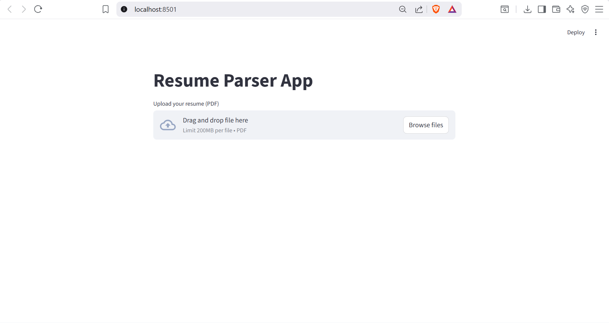
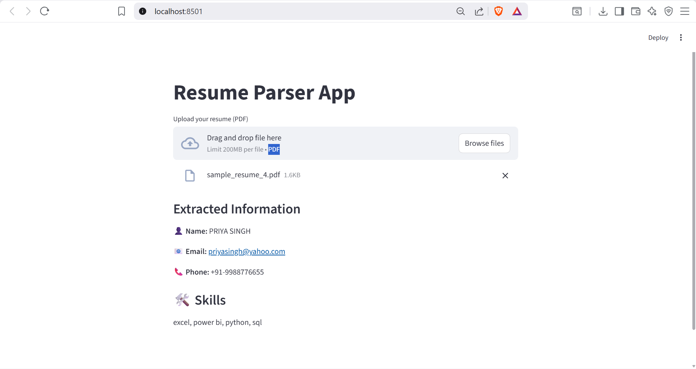

<h1 align="center">📄 Resume Parser using NLP & Streamlit</h1>

<p align="center">
  <b>An intelligent Resume Parsing application built with Python & NLP</b><br/>
  Extracts key information from PDF resumes using an interactive Streamlit interface
</p>

<p align="center">
  
  
  
</p>

---

## 🚀 Features

✨ **Smart Resume Upload** – Supports resumes in **PDF format**  
🧠 **Intelligent Parsing** – Extracts:
- 👤 Name  
- 📧 Email  
- 📞 Phone Number  
- 🛠️ Skills  

⚙️ **NLP & Regex Based Extraction**  
🎨 **Clean and user-friendly Streamlit UI**  
📄 Works across **multiple resume formats**

---

## 🛠 Technologies Used

| Technology | Purpose |
|----------|---------|
| 🐍 Python | Core programming language |
| 🧠 NLP | Text understanding & processing |
| 🔍 Regex | Pattern-based extraction |
| 🌐 Streamlit | Web interface |
| 📄 PDF Parsing | Resume text extraction |

---

## ⚙️ How to Run the Project

1. Install the required libraries:
   ```bash
   pip install streamlit
   streamlit run app.py

<p align="center">  <br/><br/>  </p>
